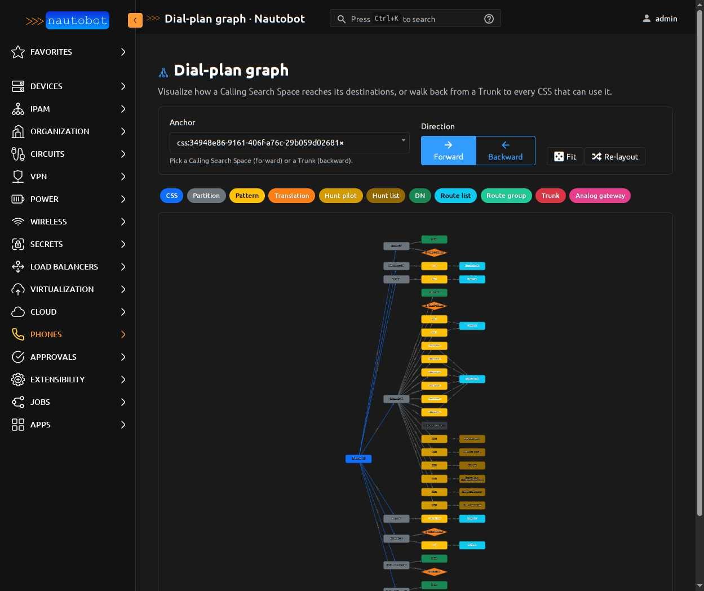
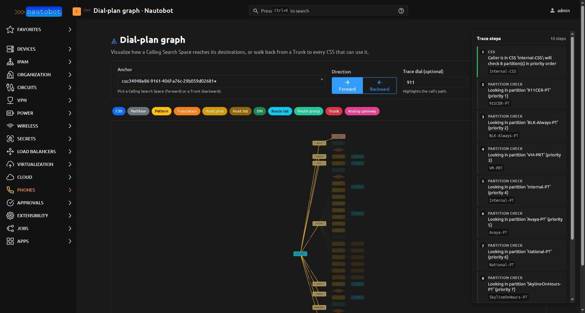

# Dial-Plan Graph

An interactive topology view of the dial plan. Where the
[dial-plan trace](dialplan_trace.md) answers *"what happens for this one
call?"* step by step, the graph answers *"what is the **shape** of the
dial plan around this anchor?"* as a single picture you can pan, zoom,
and overlay traces on top of.

Operationally it pairs with the trace: when a service desk gets a
ticket like "Alice can't dial 911," opening the graph at Alice's CSS
with `911` in the trace-dial input shows both **the topology** and
**the call path on it** simultaneously. Paste the URL into the ticket
and tier-2 sees exactly what tier-1 saw.

## Reaching the graph

Two entry points:

* **Apps → Phones → Dial-plan Graph** in the side nav
* Direct URL: `/plugins/phones/dialplan-graph/?anchor=<kind>:<uuid>[&direction=...][&dialed_digits=...]` — shareable, deep-linkable

## Two directions

### Forward — anchor is a CSS

Walks **CSS → partitions → patterns → destinations** (DNs, Trunks via
RouteList, Trunks direct, HuntPilots).

Operator question: *"What can this CSS reach?"*

Use it for:

* Visual sanity check after editing a CSS — did the new partition end up where you intended?
* Onboarding a tier-2 engineer to "how is this customer's dial plan structured"
* Compliance: at a glance, does this CSS reach anything it shouldn't?

### Backward — anchor is a Trunk

Walks **Trunk ← RouteGroups ← RouteLists ← RoutePatterns ← Partitions
← CSSes** (plus the rare RoutePatterns that target a trunk directly).

Operator question: *"Who can use this trunk?"*

Use it for:

* **Trunk decommissioning safety**: before you yank a trunk, see every
  CSS that can route to it — surprises here become outages.
* Capacity / load assessment: which CSSes share this egress?
* Compliance: e.g. confirm a recording trunk isn't reachable from an
  unauthorized CSS.

## Reading the graph

Nodes are color-coded by kind (legend at the top of the page):

| Color | Kind | What it is |
|-------|------|------------|
| Blue | **CSS** | Calling Search Space — the call's authorization scope |
| Gray | **Partition** | A bucket of patterns/DNs that a CSS can scan |
| Yellow | **Pattern** | RoutePattern — `9.NXX.XXXX`, `\+.@`, etc. |
| Orange diamond | **Translation** | TranslationPattern — rewrites digits, re-enters dial plan |
| Amber | **Hunt pilot** | HuntPilot DN that hands off to a hunt list |
| Dark amber | **Hunt list** | HuntList → LineGroup → ringing DNs |
| Green | **DN** | DirectoryNumber — rings the phones holding it |
| Cyan | **Route list** | Ordered priority list of route groups |
| Teal | **Route group** | Group of trunks/gateways with a distribution algorithm |
| Red hexagon | **Trunk** | Egress to PSTN / SIP carrier / cluster peer |
| Pink | **Analog gateway** | FXS/FXO gateway egress |
| Dashed gray | **Collapsed** | "+ N more" supernode for items past the fanout cap |

Edges carry small labels (priority numbers, pattern strings) and are
color-coded by relationship kind: blue for CSS→partition priority,
cyan for route-list priority, teal for route-group priority.

## Aggregation: why some leaves are buckets

A real Cisco CCM partition can hold hundreds of DNs and translation
patterns. Rendering one node per item produces a canvas with thousands
of nodes — unreadable. The graph aggregates:

* **DNs and TranslationPatterns** in the same partition collapse into
  a single `📋 N DNs` supernode when count > 1. Click the supernode
  to navigate to the partition detail page where the full list lives.
* **RoutePatterns and HuntPilots** render individually up to a cap
  (`PATTERN_FANOUT_LIMIT`, currently 8). Past the cap, the tail
  collapses into a `+ N more` supernode. These are operationally
  distinct (each pattern has a different destination) so keeping them
  visible matters.

The aggregation is **automatically bypassed for items the active
trace touches** — see "Trace overlay" below.

## Trace overlay

The graph really shines when paired with a trace. Type digits into the
**Trace dial (optional)** input and the call path lights up on the
topology:

* **Yellow halo** on every node the call traverses
* **Green halo** on the call origin (the CSS or trunk you anchored at)
* **Red halo** on the terminal step (where the call lands or dies)
* **Bright yellow thick edges** between consecutive in-trace nodes
* **Dimmed (~18% opacity)** everything not on the path — the call's
  route pops visually even on a busy graph

A **side panel** appears on the right with the ordered step list (CSS
→ partition checks → match → egress). Each step is clickable: the
graph smooth-animates to focus that step's node and pulses it briefly.

The overlay is **smart about aggregation**: if the trace lands on a DN
inside an aggregated partition, that DN gets un-aggregated and rendered
individually so the highlight survives. The other DNs still bucket
under "+ N other DNs" — you keep readability *and* the trace clarity.

URL example: `/plugins/phones/dialplan-graph/?anchor=css:<uuid>&direction=forward&dialed_digits=911`

For trunks (backward + dialed_digits), the trace runs from the trunk's
`inbound_css` — so you can ask "if a call landed on this trunk dialing
X, what would the dial plan do?" If the trunk has no inbound_css set,
the graph still renders without overlay (graceful degradation).

## Controls

* **Anchor picker** — autocomplete reusing the trace form's endpoint
  search, filtered to CSS (forward) or Trunk (backward) based on the
  current direction
* **Direction toggle** — Forward / Backward. Changing direction clears
  the anchor if it doesn't match the new direction (a CSS isn't a
  valid backward anchor).
* **Trace dial** — optional digits to overlay
* **Fit / Re-layout** — re-center and re-run the dagre layout

Click any node to surface its detail-page link in the floating info
pane. Click anywhere on the empty canvas to dismiss.

## Operator workflows

### Service desk: "user can't dial X"

1. Look up the user's phone → grab their CSS (or use the trace
   form's endpoint-mode autocomplete to skip this step)
2. Open the graph at that CSS with the dialed digits in the trace
   input — both the topology and the call path render
3. If the call dies (red terminal step), the graph + side panel show
   exactly where: missing partition, blackhole route-list, no_match
4. Paste the URL into the ticket — tier-2 opens the same view

### Trunk decommissioning audit

1. Open the graph at the trunk you want to remove (Backward direction)
2. Every CSS that can reach the trunk appears, with the route-list /
   route-group chain
3. Walk back through each path — confirm a replacement is in place
   for each route-list that targets the trunk
4. If a CSS has *no other reachable trunk* for similar dial patterns,
   that's an outage waiting to happen

### Compliance: "who can reach the recording trunk?"

1. Open Backward at the recording trunk
2. Visual answer: every CSS in the graph is a CSS that can reach it
3. Cross-check against your access policy
4. Click any unauthorized CSS → detail page → fix the partition
   membership

## Limitations

* **Time-of-day routing** isn't modeled — a pattern that branches by
  hour of day shows as a single edge
* **Circuit availability** is unknown — the overlay's "likely egress"
  is the *first* candidate, not a guarantee
* **Hunt expansion in the graph** terminates at the HuntList node;
  the full LineGroup → DN expansion is in the linear trace step list
  (`hunt_subsystem` step). The trace's view of the hunt subsystem is
  more detailed than the graph's.
* **Cross-cluster ICTs** — currently treated as opaque trunks; the
  far-cluster dial plan would need to be modeled separately and
  manually linked
