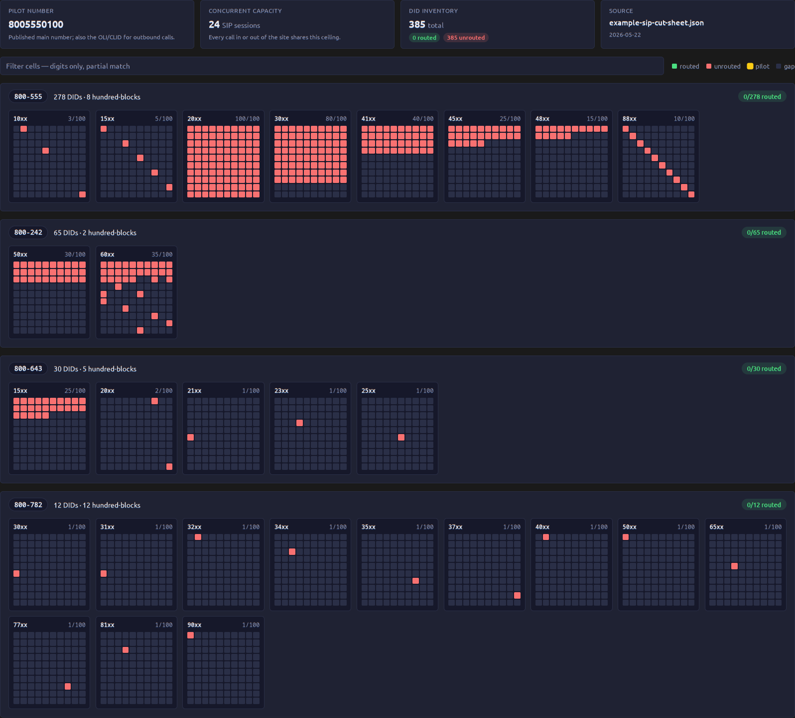
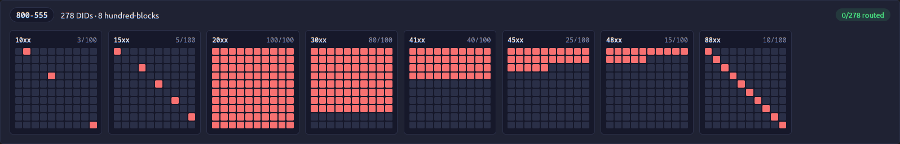

# DID Heatmap

Every [SipCircuitProfile](../models/sipcircuitprofile.md) detail page renders a full-width "DID Heatmap" panel: every DID attached to the circuit, laid out as a grid of 10×10 cells per hundred-block, grouped by NPA-NXX. Each cell represents one DID; color encodes routing status; the grid position encodes the last two digits.

It's the visual answer to two questions operators ask all the time:

1. **What did the carrier deliver?** (How many DIDs, in which prefixes, how densely?)
2. **What's actually routed to a destination?** (How much of the delivered inventory is operational vs paid-for-and-idle?)

## Reading the cells

Each cell sits at a fixed position 00–99 inside its hundred-block, so cell `42` in the `208-555-37xx` block represents DID `208-555-3742`. Cells render in one of five states:

| Cell color | Status | Meaning |
|---|---|---|
| 🟢 green | `routed` | DID has a [DIDAssignment](../models/didassignment.md) pointing at a [DirectoryNumber](../models/directorynumber.md). |
| 🔴 red | `unrouted` | DID is in inventory (either covered by a [DIDBlock](../models/didblock.md) range or materialized as a [DID](../models/did.md) row) but has no assignment. |
| 🟡 yellow | `pilot` | DID matches the profile's `pilot_e164`. Gets a subtle ring so it's locatable after filtering. |
| ⬛ faint | `gap` | No inventory record exists for this position — the carrier didn't deliver this number, or it was ported away. |

A fully-green hundred-block means "the carrier delivered a fat 100-DID chunk and we route every single one of them internally." A fully-red one means "we're paying for the entire block but routing none of it" — a cost-recovery investigation candidate. A scattered handful of green dots among gaps tells a years-long story of individual ports.

## Hundred-block grouping

NPA-NXX (the 6-digit `208-782` prefix) groups one or more hundred-blocks together. A hundred-block is the next two digits: `208-782-37` covers `2087823700`–`2087823799`. The label in each block header (`37xx`) shows just that 2-digit slice.

The "`X/100 routed`" badge in each block's top-right corner is the per-block operational metric: a green-heavy block has a high ratio, a red-heavy block has a low ratio (or zero in the pre-DIDAssignment baseline).

The "`X/Y routed`" badge in each NPA-NXX group header rolls those up — useful for catching whole prefixes that are paid-for but never wired.

## Summary cards (top of panel)

Four cards above the grid pull from the SipCircuitProfile fields and a tally of cell states:

- **Pilot number** — `pilot_e164` (the OLI/CLID for outbound calls).
- **Concurrent capacity** — `sip_sessions` (the hard cap on simultaneous calls across the entire DID pool).
- **DID inventory** — total cells with `routed` + `unrouted` pill counts. The instant DIDAssignment data lands, these flip green-vs-red and the headline becomes a live operational metric.
- **Source** — `source_doc` and `cut_sheet_received_date`, so operators can trace the data back to the originating vendor document.

## Search filter

The search input across the top of the panel does a client-side dim of any cell whose E.164 string doesn't contain the typed substring. Three useful patterns:

| Type | Effect |
|---|---|
| Full prefix (`208782`) | Isolates one NPA-NXX. |
| Hundred-block prefix (`20878237`) | Isolates one 100-cell grid. |
| Partial suffix (`5050`) | Highlights every DID ending in that 4-digit pattern across all blocks. |

The filter runs in pure JavaScript over the rendered DOM — no API call, instant for 1,000+ cells.

## When the colors are honest

In the absence of [DIDAssignment](../models/didassignment.md) data, every cell renders as `unrouted` (red). That's a *valid baseline* — it answers "what's the worst case if we never route a single number" — but the heatmap earns its complexity once `DIDAssignment` rows exist to flip cells green. The intended workflow:

1. **Ingest the cut sheet** → see solid-red baseline for the new circuit.
2. **Run the CCM/FreePBX sync** → DirectoryNumber records get created.
3. **Wire DIDAssignment** rows linking each delivered DID to its DN.
4. **Reload the heatmap** → cells flip green as the assignments land; uncolored regions surface gaps that need translation patterns or porting decisions.

Step 3 happens manually today; future work will add a sync-time bulk-assign helper.

## How the data is built

The heatmap data is built in `nautobot_phones.heatmap.build_heatmap_data(profile)`. The pipeline:

1. Expand every [DIDBlock](../models/didblock.md) on the circuit into its constituent E.164 strings.
2. Dedupe against individually-materialized [DID](../models/did.md) rows on the same circuit.
3. Look up routing status by joining against [DIDAssignment](../models/didassignment.md) (target_type=directorynumber).
4. Group every E.164 by its 8-digit hundred-block prefix, then by its 6-digit NPA-NXX.
5. Fill in `gap` cells for every absent position 00–99 in each hundred-block so the layout is geometrically uniform.

The cells render via a `Panel` subclass (`DIDHeatmapPanel` in `nautobot_phones/views.py`) using a CSS Grid template at `templates/nautobot_phones/inc/did_heatmap.html`. No JavaScript framework, no API call, no virtualization — just a single template render serving 1,000+ cells at ~instant first-paint speed.
